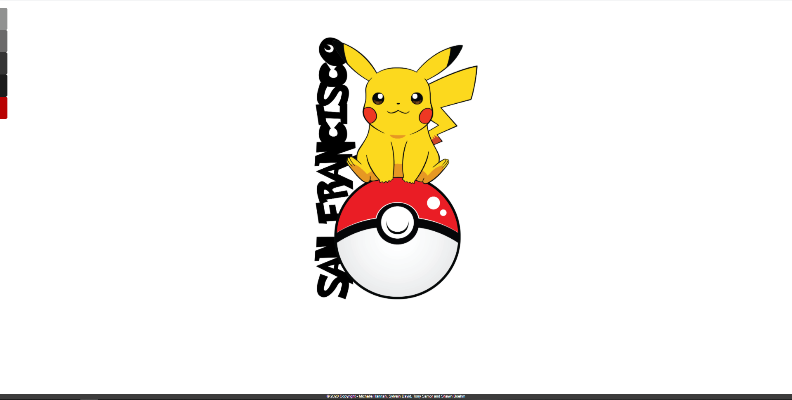
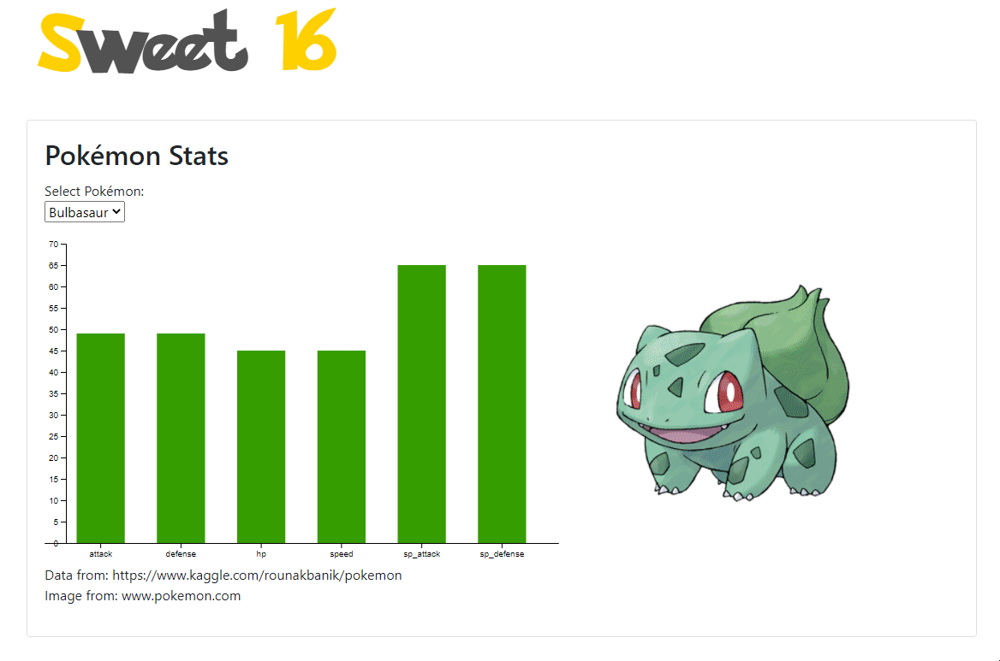
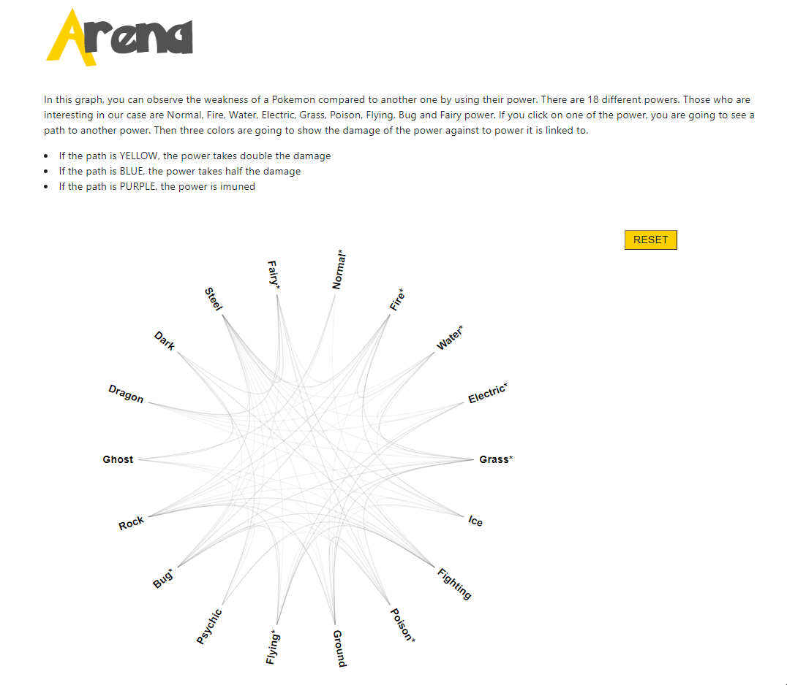

# Project-2-Pokemon# data-journalism

## SUMMARY ##
* *Overview,*
* *Webpage*
* *Sources*
* *Technologies used*

## Overview ##
On this project we focuse on the Pokemon Go in San Francisco. We decided to go for San Francisco because it is one of the few city for which we have good database in www.kaggle.com.
After working on two databases we were able to make three visualization based on two reliable databases. We mainly used SQL and D3.js to work on making ID cards for the 16 more popular Pokemon in the San Francisco area. We also made a comparative graph as well as a localization map of where the Pokemon were found. For this last visualiztion, we also used MapBox.
    
## Webpage ##
### Sweet 16  ###

On this page, you can see the 16 Pokemon. Each of them has its caracteristics as well as a image of it. The cgart shows its skills in attack, defense, HP, speed overall, attacka nd defense speed. We clean a dataset from www.kaggle.com/rounakbanik/pokemon in order to keep the necessary information that interested our project.
For the image, we use web scrapping by linking it to the official Pokemon website. wwww.pokemon.com

### Arena ### 

In this graph, you can observe the weakness of a Pokemon compared to another one by using their power. There are 18 different powers. Those who are interesting in our case are Normal, Fire, Water, Electric, Grass, Poison, Flying, Bug and Fairy power.
If you click on one of the power, you are going to see a path to another power. Then three colors are going to show the damage of the power against to power it is linked to.
* If the path is YELLOW, the power takes double the damage
* If the path is BLUE, the power takes half the damage
* If the path is PURPLE, the power is imuned

### Gotcha ### 
  
On this page, we can localize where the Pokemon where found in San Francisco. For the dataset we used www.kaggle.com. After cleaning it we were able to use the latitude and longitude of where the Pokemon was spotted in order to visualize it on the map using the mapbox support.

## Technologies used ##
* HTML 5
* CSS 3
* Javascript
* Bootstrap
* D3.json
* D3-tip.js
* Mapbox
* Leaflet
* CSV file
* SQL
  
## Authors ##
* Michelle Hannah, Sylvain David, Tony Samor and Shawn Boehm - Data Analytics Bootcamp - Vanderbilt University - 2020
